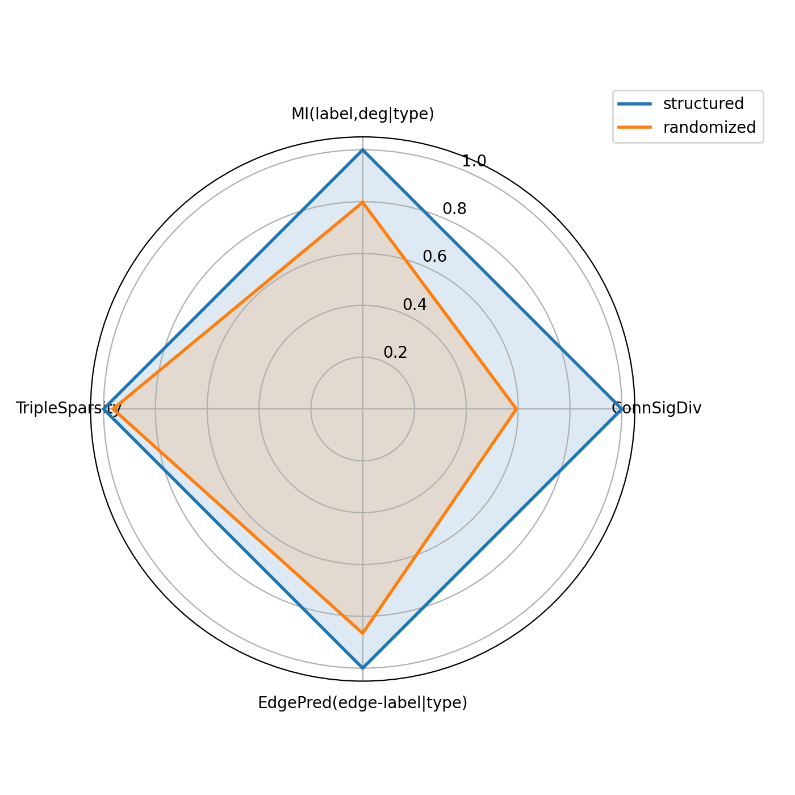

# 一、选题的来源、研究意义及价值，选题的创新性，国内外研究现状及水平等

## 1、选题来源、研究意义及价值和选题创新性

选题源于导师主持的国家自然科学基金重点项目“基于度量空间的图数据通用表征理论与方法”中的课题三：通用图表征方法的评价体系及其应用评估。本研究旨在构建一个标准化的图表征评估体系，涵盖不同类型的图数据、统一的基准方法和通用的评价指标，同时结合无任务依赖的评估方式与基于任务的评估方式，以提供全面、系统的性能衡量框架。本研究预期实现的部分是评估体系的起点——不同类型图数据集的生成。

在图表征方法的研究与应用中，统一的数据基础与标准化流程是性能评估的前提。不同领域图数据集的系统化生成，既能扩展评估体系的适用范围，使其涵盖社交网络、分子结构、知识图谱等多样化场景，从而提升模型比较的全面性与科学性；也能为工业界提供统一的测试环境，使不同模型在实际任务中能够在相同条件下进行验证。这一过程提高了模型选择的可靠性，并为图表征技术在多领域的落地应用创造了条件。具体而言，在网络安全中，标准化的社交网络数据集能够支持虚假账号检测模型的公平比较；在智慧医疗中，统一的知识图谱数据集可以帮助评估不同模型在临床决策支持中的推理能力；在药物研发中，多样化的分子图数据集能够检验模型在药物作用机制预测上的泛化性能。同时，已有研究也开始探索通过先进的图生成模型来扩展数据集的多样性，例如基于扩散模型的同质图生成方法和面向异质图的分层生成框架。这些工作表明，数据集生成不仅需要覆盖不同场景的图结构，还应在结构真实性、特征分布合理性和生成质量控制方面形成统一机制，从而为后续评估体系的完善提供坚实支撑。

尽管现有的评估体系在一定程度上推动了研究的规范化，但仍存在数据类型覆盖不足的问题，限制了框架的普适性。不同的图数据类型（如同质图与异质图、静态图与动态图、多模态图与单模态图）具有差异化的结构与信息分布，不同任务（如节点分类、链路预测、图级回归）也侧重于不同层级的图结构。因此，研究者不得不针对具体任务和数据特点选择合适的数据集或生成模型。然而，不同来源的数据集在存储格式、接口规范及使用方式上往往缺乏统一，不同生成模型的调用方式与输出结构也存在差异。这些不一致性使得研究者在数据准备环节需要进行多种情境下的额外预处理与适配，显著增加了工作复杂度，造成资源浪费和开发周期延长。若能突破这一瓶颈，在数据准备环节建立覆盖多类型图结构的统一生成机制，将有效提升数据构建的效率与一致性。为此，本研究将重点聚焦于不同类别图数据集的生成，尤其是同质与异质图的系统化构建，旨在为后续的基准方法设计与评价指标构建提供统一的数据基础。

本研究的创新性主要体现在数据集生成的设计目标与实现方式上。现有工作在数据集构建方面通常局限于特定类型的图结构，往往仅针对同质图或异质图进行设计，对另一种类别的兼容性有限，难以兼顾不同类别的统一需求。本研究提出**基于子类别图（subtype）的扩散生成方法**，实现对同质图与异质图的共同适配。具体而言，**子类别图（subtype）**指在原有节点/边类型基础上的进一步细分类别所构成的子结构单元。在节点层面，例如在异质图中若节点类型为“作者”与“论文”，子类别图可将作者细分为“教授”“工程师”等身份、将论文细分为“应用文”“综述”等题材；在边（关系）层面，图生成中结构生成占比较大，边同样可划分子类别：最基础者即为边的存在与否，更细粒度则可对关系类型再细分，例如作者与论文之间的“撰写”关系可细分为一作、二作、通讯等角色，从而在节点与边上均提供更细粒度的语义视角。本研究在技术实现上设计了专门的智能体（agent）负责子类别划分，该设计具有三方面考虑：一是提供更深入的结构语义视角，便于生成模型捕捉细粒度模式；二是与图扩散模型在离散空间上的建模特性相契合，使扩散与恢复过程在子类别维度上更加自然；三是为信息量有限的数据集注入更丰富、可解释的语义信息，相比单纯依赖随机游走等方式为稀疏特征补全向量，子类别划分具有更明确的语义依据与可解释性。在生成框架上，由于扩散过程是**面向子类别（subtype）**进行的（涵盖节点与边/结构的子类别），模型只需关注各子类别上的扩散与恢复状态即可；对异质图而言，通过对不同关系族进行隔离建模即可纳入多类型关系，而同质图可视为仅含单一关系族的特例。因此，同一套“子类别 + 扩散/恢复”的流程即可统一覆盖同质图与异质图，在方法论上实现共同适配。与 HGEN【HGEN】等异质图生成方法不同，HGEN【HGEN】采用异质路径生成与图组装的分层机制，侧重于路径级语义与图级组装；本研究则以子类别图（subtype）为扩散单元，在同一扩散框架下直接对子类别结构进行扩散与恢复，并通过对关系族的统一抽象将同质图与异质图纳入同一设计，在建模单元与适配范围上与现有异质图生成方法形成明确区分。上述设计不仅拓展了评估体系的数据覆盖范围，也在方法论上保证了生成过程的普适性与跨场景稳定性，为通用图表征的系统化评估奠定了坚实基础。

## 2、国内外研究现状

在国内，图数据生成与图表征评估相关的研究目前仍以应用场景的探索为主，面向图结构生成算法本身、尤其是与扩散模型及异质图生成相结合的系统性工作相对较少，算法层面的创新多集中在图神经网络架构与下游任务优化。因此，本小节以国际上的代表性工作为主线进行综述，以明确本研究所在的问题背景与技术脉络。

在国际研究方面，斯坦福大学提出的 Open Graph Benchmark (OGB)【OGB】为图神经网络模型的评测提供了统一的数据划分与评价指标，涵盖社交网络、生物分子、知识图谱等多类数据集，推动了图表征学习的标准化与可复现性。随后扩展的 OGB-LSC【OGB-LSC】更强调在大规模图数据上的模型创新与评测。然而，学术界长期依赖少量经典数据集，覆盖面有限。为解决这一问题，GraphWorld【GraphWorld】提供了可生成大规模合成图数据的框架，研究者能够通过可控参数自动化地产生上百万个具备不同统计特性的合成图数据集，用于系统性分析 GNN 模型的表现，揭示标准数据集无法体现的差异。然而，合成图虽然数量庞大、生成灵活，但在真实性和跨类型适配方面仍存在不足，难以完全替代真实场景中的复杂图结构。

在这一趋势的推动下，研究者进一步将生成模型引入图数据集构建之中，试图在保证评估多样性的同时提升生成质量与真实性。在同质图生成方面，已有研究主要集中于如何在保持拓扑约束的同时提升生成质量与效率。DiGress【DiGress】 提出了离散去噪扩散方法，将扩散过程直接作用于图的离散结构，从而生成符合拓扑约束的高质量样本；SparseDiff【SparseDiff】 作为基于离散扩散的基线方法，通过稀疏离散扩散框架提升了生成效率，使得在大规模场景下依然能够保证可扩展性与结构合理性。本研究即在 SparseDiff【SparseDiff】 的基础上进行扩展与调整，包括对异质图的适配、子类别图的引入以及统一同质/异质生成的框架设计等，以形成面向多类型图数据集的生成能力。上述同质图方法在单一类型图结构上表现突出，但其适用范围仍局限于同质图场景。相比之下，异质图生成的研究仍处于探索阶段。HGEN【HGEN】 通过异质路径生成与图组装的分层机制，联合建模语义、结构和分布信息，从而生成更符合真实语义模式的异质图。该方法在保持复杂关系的同时提升了生成图的结构合理性与分布一致性。然而，异质图生成的挑战在于类型多样、语义复杂，现有方法数量有限，尚未形成统一的生成标准。与 HGEN【HGEN】 的路径级生成与图组装思路不同，本研究以子类别图为扩散与恢复的基本单元，在同一扩散框架下通过对关系族的抽象与隔离实现同质图与异质图的统一生成，在建模粒度与框架普适性上与现有异质图生成方法形成区分。这些探索表明，现有生成模型在同质图与异质图的构建上各有突破，但仍呈现出分裂状态：同质图方法更注重拓扑约束与效率，异质图方法则强调语义建模与结构合理性。

结合上述现状可以看出，现有研究在数据集构建上仍存在局限：一方面，GraphWorld【GraphWorld】 等框架能够生成大规模合成图，但其真实性与跨类型适配能力有限；另一方面，扩散类方法在提升生成质量与结构合理性方面取得进展，却同样局限于特定类型。整体而言，缺乏统一的生成机制使得不同类型数据集难以在同一评估框架下整合。因此，本研究聚焦于同质与异质图数据集的系统化生成，通过子类别图的扩散生成方法实现两类图结构的共同适配，为通用图表征的评价体系提供更全面的数据基础。本研究正是针对这一问题提出解决方案，旨在从数据准备环节突破现有瓶颈，为后续基准方法设计与评价指标构建奠定基础。

二、论文研究的主要内容及拟解决的主要问题，特色与创新、重点和难点，拟采用的研究方法、手段或方案，研究计划与可行性分析

（一）论文研究的主要内容及拟解决的主要问题

本论文围绕“面向通用图表征评估体系的多类型图数据集生成”这一目标，重点针对同质图与异质图在统一框架下的生成机制缺失、真实数据特征稀疏与语义信息不足、以及现有评估流程中数据构建环节碎片化等问题开展研究。主要研究内容概括如下：

1. 引入子类型（subtype）的细粒度语义建模。

针对现有图数据集中节点/关系语义信息粗粒度或缺失的问题，在原有节点/关系类型之上进一步细分得到子类型，形成具有更丰富语义的离散建模单元。如图 1 所示，在学术异质图中，节点类型“作者”可细分为“教授”“博士”等身份，节点类型“论文”可细分为“应用文”“综述”等题材；在关系层面，最基础的子类型可对应于关系存在与否，更细粒度则可将“作者–论文”的撰写关系细分为“一作”“二作”“通讯作者”等子类别。论文将围绕子类型的构建、存储与调用机制展开系统设计，使语义约束能够稳定融入扩散训练与恢复过程。

为避免子类型在工程上退化为**任意增删符号或仅凭频次堆砌**，需要与之配套的**语义细粒度（丰富度）可计算评判**。本研究在不依赖具体语义类目名称先验的前提下，从**模式层次、统计关联与局部连接规律**等维度，将「是否与拓扑统计相一致」操作化为六项可复现指标：**SchemaRichness**（粗粒度「节点类型数 + 边类型数」取对数，刻画**类型表规模**，与 subtype 置换通常无关）、**HierarchyDepth**（是否包含节点/边 **subtype** 层级，取 1/2/3）、**MI(label, degree | type)**（粗类型内细标签与度分箱的互信息）、**ConnSignatureDiv**（不同细标签群体在出邻标签分布上的 Jensen–Shannon 型组间差异）、**EdgeLabelPredictability_WithinType**（已知源端粗类型与细标签时边标签的可预测性）、**TypedTripleSparsity**（源端细标签—边标签—目标端细标签三元组相对全组合空间的选择性）。指标定义与程序实现见 `dataprocess/semantic_richness/evaluate_semantic_richness_label_agnostic.py`。在 **structured** 与 **subtype 置换对照**的配对中，**SchemaRichness** 与 **HierarchyDepth** 往往恒等，**不携带「真结构 vs 打乱」的判别信息**，故默认 `metrics_normalized.csv` 与图 2 **仅对后四项结构敏感指标**做归一化与网状雷达展示；完整六项仍保留于 `metrics_raw.json`。检验规程上，在**拓扑与 subtype 边际频次受控**条件下，以**原始图（仅粗粒度类型）**、**structured** 及 **subtype 置换对照**构成完整对照链条；**核心配对检验**仍为 structured 相对置换对照——当二者在 **HierarchyDepth**、**SchemaRichness** 上对齐，且 structured 在后四项上系统优于置换对照时，即支持通过结构一致性检验。默认图 2 仅在 structured 与置换对照间绘制四维雷达；若需纳入原始图并恢复六轴，可使用 `--versions raw,structured,randomized`。图 2 基于当前示例子图（由 `dataprocess/semantic_richness/out/` 导出，副本存于 `docs/figures/semantic_richness_radar.png`）。

2. 统一适配的模型设计：通过边类别抽象对齐同质/异质表征。

在统一离散扩散模型中，针对异质图的多关系差异，引入**关系族**作为粗粒度**边类别**的抽象：每一关系族对应一类边类别，其下再容纳多种边子类别。**（框架图如图 3 所示）**扩散过程中在表示与消息传递等计算环节对不同关系族相互隔离，使各族的边子类别在独立的离散空间内演化，从而避免跨关系的语义串扰。同质图可视为仅含单一关系族的特例，与异质图共享同一套形式化与实现路径。该设计在形式上统一同质与异质的表征方式，在语义上保持关系边界清晰，为后续结构学习与一致性约束提供稳定的建模基础。

3. 稀疏机制：稀疏化离散扩散模型以提升拓展性。

针对扩散模型在结构空间上的计算与显存开销随节点数与边数显著增长（典型朴素实现可呈现 **O(N²)** 量级依赖）的问题，本文采用稀疏化的结构组织策略与局部预测训练范式，控制关键中间量的生成与保留方式，使训练与采样在资源受限条件下仍保持可操作性。优先聚焦中等规模图与局部结构建模，并将面向更大规模图的进一步可扩展训练与采样作为后续拓展方向，形成可持续的规模扩展路径。

4. 块状查询：改善局部结构可学性与推断一致性。

在稀疏设定下，本文设计基于**边集分块**的查询机制：不将每步待预测边视为在全空间上无差别的随机子样本，而是将全部可能边划分为若干互斥块，训练时每一步仅在当前块上施加预测与监督，并通过轮换使各块在训练过程中被系统覆盖。与之配套，采样阶段采用与训练**一致的分块划分与覆盖策略**组织多步更新，保证推断时的查询组织方式与训练口径对齐，同时使推断结果覆盖全部可能边。该机制使边级监督在可能边空间上分布可控、可复现，并为局部共现与高阶闭合结构在分块全遍历前提下提供更稳定的优化路径。

围绕上述内容，论文拟重点解决以下几个主要问题：

（1）缺乏统一的多类型图数据生成机制。

如何在单一扩散框架下同时支持同质图与异质图的生成，使不同类型数据集能够在相同的生成与评估流程中被一致对待。

（2）真实图数据中语义特征稀疏、子结构语义难以显式建模。

如何通过子类别划分与智能体辅助标注，为节点与边引入更细粒度的语义信息，使扩散模型能够在离散语义空间中进行更具可解释性的建模。

（3）稀疏处理机制不足导致的拓展性受限。

如何在稀疏生成与局部预测约束下，通过稀疏化优先的工程实现降低训练/采样的显存与计算开销，从而提升对更大规模图与更复杂关系设置的拓展能力，并保证生成结果与评估流程具有良好的可操作性。

（4）稀疏与局部预测下的边级监督组织与推断一致性。

如何在仅更新部分边的稀疏设定下，对可能边空间进行**可复现、可全遍历**的分块组织，使训练阶段的查询与监督分布可控，并使采样推断阶段在**与训练一致的分块策略**下覆盖全部可能边，从而兼顾局部结构可学性与训练—推断口径对齐。

（二）特色与创新

在“一”部分已经从宏观角度给出了本研究的创新性，在本节中按**数据层 → 模型设计 → 稀疏设定下的查询与推断组织**的顺序，对特色与创新做对应说明：

1. 智能体驱动的数据层细粒度子类别建模与可检验语义准则。

针对公开数据集中细粒度注释稀缺的问题，本研究在数据准备阶段引入**智能体（agent）**驱动的子类别划分：综合利用拓扑结构、文本与元信息挖掘候选子类别，并以规则与专家先验约束输出一致性。与随机游走或简单统计式特征补全相比，该路径在信息来源与语义指向上更为明确，便于与下游离散扩散条件对齐。进一步地，本研究将子类别“语义丰富度”操作化为**不依赖具体类目名称先验**的可计算评判标准；完整规程包含**原始图—structured—置换对照**三版本，**默认图表与脚本输出**则聚焦 **structured 与置换对照**的配对比较，以区分“结构一致的子类型”与“仅保留边际分布的标签重排”，使子类别划分**可审计、非任意**，与后文评判标准设计及实验口径一致。

2. 基于子类别图与关系族隔离的统一离散扩散模型设计。

在建模层面，本研究以**子类别图**为基本对象，将生成单元从“节点类型—边类型”的粗粒度提升到**子类别级**联合离散空间；通过**关系族**抽象异质多关系，使每一族对应一类粗边类别并在其下容纳边子类别，扩散过程中在表示与消息传递环节对各族**相互隔离**，同质图则作为**单关系族特例**纳入同一形式化与实现路径，从而在统一框架内对齐同质/异质表征并抑制跨关系语义串扰。与以 HGEN【HGEN】 为代表、依赖“异质路径生成 + 图组装”的路线相比，本研究在单一离散扩散骨架内直接对节点/边的子类别结构联合建模。工程上在 SparseDiff【SparseDiff】 基线上扩展多维离散条件输入，并对图 Transformer 做异质化改造（类型嵌入、子类别嵌入、关系族偏置等），在显存与算子层面面向稀疏边集做适配，为在中等规模图上的可复现训练与扩展留出空间。

3. 稀疏设定下的块状查询与训练—推断一致性。

在结构空间稀疏化与局部预测前提下，本研究提出**边集分块查询**：将可能边空间划分为互斥块，训练时按块轮换施加监督，使边级信号在全局可能边上**分布可控且可全遍历**；采样推断采用与训练**一致的分块划分与覆盖策略**，避免“训练时一种 query 组织、推断时另一种”导致的口径漂移。该设计与内容（一）中的稀疏机制相衔接：在控制 **O(N²)** 朴素依赖与显存峰值的同时，为局部共现与高阶结构提供较稳定的优化路径，形成从数据语义、模型形式到训练组织的闭环特色。

（三）研究重难点及对策

**重难点 1：子类别智能体标注的可控性与成本**

**采取的对策：**  
采用分层调用策略：对需要强推理与方案稳定的环节（如类别体系约定、冲突仲裁规则、输出 schema 设计等）选用能力更强的语言模型；对大规模、重复性高的逐节点/逐边子类别赋值环节，选用高吞吐、低延迟的模型以控制时延与费用。在提示设计上，构建可复用的精简模板：以固定字段与枚举约束压缩输出空间，在提示中显式给出可泛化的角色定义、禁止项与反例，在保证领域可迁移的前提下减少冗长说明。在成本控制上，结合提供高额度的 API 配额开展迭代与消融（如选用当前赠送 300 美元免费额度的 Gemini 等），并通过分块批量请求、缓存系统提示与 schema、元信息摘要后再入模等方式降低单次与总体 token 消耗。

**重难点 2：异质子类别与有向语义下的网络与数据对齐**

**采取的对策：**  
在 SparseDiff 类离散扩散骨架上，对去噪网络做结构化扩展：在嵌入与消息传递各环节中显式引入节点与边子类别离散状态，并通过关系族隔离组织异质多关系，使注意力与聚合在族内/族间与数据模式一致，避免关系混淆。在输入与调制方式上，采用「粗粒度类型嵌入 + 子类别 FiLM 式调制」一类设计（类型提供共享表征基底，子类别生成缩放/平移参数细化表征），使子类别在不过度增加参数的前提下参与 Q/K/V 等量的构造；在边信息利用上，将边特征与节点对交互项结合，经关系感知调制后再进入注意力打分与消息聚合，以体现不同关系族下的语义差异。  
在数据与拓扑层面，采用局部连通子图构造（如基于种子的 BFS / k-hop ego 扩展）生成训练与评估用图实例，保证拓扑连贯。

（五）研究计划与可行性分析

1. 研究计划

拟定的工作进度按当前阶段目标与截止节点安排如下（NeurIPS 截稿若有年度微调，以会议官方通知为准）：

（1）**2026 年 4 月 15 日前**：完善系统实验与对比分析。在多个数据集上补齐生成质量与下游相关评估，完成不同子类别划分、关系族与采样设置的对照；与现有生成框架（如 GraphWorld【GraphWorld】）及异质图生成方法（如 HGEN【HGEN】）等进行系统对比，形成可写入论文的图表与结论。

（2）**2026 年 5 月前**：完成学位论文撰写与统稿。在实验对比定稿基础上，完成方法、实验与讨论各章的撰写与修改，保证与 SparseDiff【SparseDiff】 扩展路线及当前实验口径一致，并预留答辩与后续汇报所需的材料整理时间。

（3）**2026 年 5 月 11 日**：完成 NeurIPS 会议论文投稿。在实验与文稿就绪的前提下，按 NeurIPS 当年投稿系统要求完成全文、附录与补充材料的上传与提交。

2. 可行性分析

本研究具有较好的可行性，主要体现在以下几个方面：

（1）理论与方法基础。依托导师主持的国家自然科学基金重点项目，已有关于通用图表征与评估体系的理论积累，同时已有 SparseDiff 等离散扩散模型作为坚实基线，为本研究在扩散建模与生成流程方面提供了成熟的理论与实现基础。

（2）数据与代码基础。目前已在多个数据集（ACM、IMDB、PubMed、DBLP 等）上建立了数据加载与训练评估流程，具备较完整的训练、评估管线；已有模型代码中已经支持异质图模式、关系族与子类别相关元数据的输入与嵌入，这为本研究在此基础上的扩展提供了直接的工程支撑。

（3）计算与实验条件。研究依托所在课题组的计算资源与开发环境，实验节点为 **Ubuntu 20.04 LTS**，配备 **双路 Intel Xeon E5-2680 v3**（共 **48** 逻辑 CPU）、内存 **约 504GB**，以及 **8×NVIDIA GeForce RTX 2080 Ti**（单卡 **11264MiB** 显存，驱动 **530.30** 系列，**CUDA 12.1** 环境），可支撑多卡 DDP 与并行消融；存储含系统盘约 **916GB** 及数据盘约 **1.8TB**。已配置 PyTorch、Hydra、W&B 等训练与记录栈，并在此基础上开展过多轮实验，表明在当前资源条件下完成预期规模的训练与评估是可行的。

（4）个人基础与导师指导。申请人在前期已参与相关项目代码的阅读与改造，对现有扩散框架、数据处理流程与异质图建模具有一定实践经验；在课题方向、方法论证与阶段性检查方面接受导师指导，保障研究计划可检查、可纠偏。

综上所述，本研究在理论基础、数据与代码资源、实验条件以及导师指导与个人实践等方面均具备较为充分的可行性，研究计划具有可执行性与可控性，有望在预定时间内完成预期研究目标并取得具有一定推广价值的研究成果。

三、已有的科研工作基础和已具备的科学研究条件（包括文献资料及主要实验仪器设备准备情况等），对其它单位的协作要求；论文总工作量（估计），论文初稿的进度以及预期目标或结果。

1. 已有科研工作基础

（1）第一作者学术论文与竞赛型大规模检索工作。

申请人以第一作者身份完成论文【MCDiskANN】《Memory-Constrained DiskANN: Efficient Approximate Nearest Neighbor Search Under Resource Constraints》。工作面向近似最近邻检索（ANN）在大规模高维向量场景下的工程落地，针对 2025 SISAP Indexing Challenge 的 Task 1：在约 2300 万条、384 维向量规模上，在严格的内存与磁盘预算下开展检索，赛题对平均召回率提出约 0.70 的达标要求。

在方法上，以 DiskANN 类流水线为基座并引入两项改进：其一，采用 PCA 降维将向量表示压缩到满足内存上界的维度，保证索引构建与查询阶段的驻留内存可控；其二，改进 second-assignment 机制——对候选点按距离排序后，仅将较近的一半指派到次级分片（secondary shard），在固定资源下更合理地分配跨分片负载。实验表明，在上述约束与评测协议下，整体召回率可达约 0.80，优于赛题给定的召回门槛，体现了在硬约束下进行算法设计、系统实现与指标验证的一体化能力。

（2）与当前工作研究方向的衔接。

上述工作虽聚焦于向量索引与检索，但与当前课题在大规模离散对象上的高效计算、显存/存储等资源的显式预算、以及可复现的对比评测与论文写作等方面具有相通的方法论积累；相关经历为后续在图扩散生成中的稀疏训练、工程化消融与论文撰写提供了前期训练基础。

（3）子类别语义丰富度的评判标准设计。

子类别若缺乏可操作的**质量准则**，易退化为随意增删标签或仅按频次堆砌符号，难以在生成建模中承担**可解释的离散语义**角色。为此，本研究将**语义丰富度**操作化为**一组可计算、可复现的评判标准**：在**不依赖具体语义类目名称先验**的前提下，从**模式层次、统计关联与局部连接规律**等维度度量细粒度标注是否携带**与拓扑一致的结构性信息**。指标定义与计算实现见 `dataprocess/semantic_richness/evaluate_semantic_richness_label_agnostic.py`。评判条目包括：**SchemaRichness**（粗粒度类型表规模，对数）、**HierarchyDepth**（节点/边 subtype 层级深度 1/2/3）、**MI(label, degree | type)**（粗类型内部的细标签—度分箱互信息）、**ConnSignatureDiv**（不同细标签群体在出邻标签分布上的 Jensen–Shannon 型组间差异）、**EdgeLabelPredictability_WithinType**（在已知源端粗类型与细标签时边标签的可预测性）、**TypedTripleSparsity**（源端细标签—边标签—目标端细标签三元组相对全组合空间的选择性/稀疏性）。**SchemaRichness** 与 **HierarchyDepth** 在 structured 与置换对照之间通常相同，故默认配对图表仅展示**后四项**；前两项仍写入 `metrics_raw.json` 供完整记录。上述标准共同回答：子类别是否在**度结构、邻域组成、边语义与共现模式**上与图结构形成**稳定耦合**，而非仅增加符号种类。

为检验划分结果是否满足上述标准，采用**同一数据三版本**的对照规程（拓扑不变、频次受控）：**raw**（**原始图**，仅保留粗粒度类型字段）、**structured**（与真实观测共现一致的 **subtype**）、**置换对照**（与 **structured** 的 **subtype** 边际分布相同，但对 **subtype** 作置换，解除标签与局部连接的对应）。**通过准则**可表述为：在 **HierarchyDepth** 与 **SchemaRichness** 等规模类指标在 **structured** 与**置换对照**上保持一致的前提下，若 **structured** 在 **ConnSignatureDiv**、**MI(label, degree | type)**、**EdgeLabelPredictability_WithinType**、**TypedTripleSparsity** 等结构敏感项上**一致优于置换对照**，则判定当前子类别标注**通过**「结构一致性」检验，即并非任意划分；若二者接近，则表明子类别与拓扑**未形成可区分的统计关联**，需回溯划分规则或数据接口。该规程与六项标准共同构成子类别质量的**可审计链条**。默认评测脚本**仅读取 structured 与置换对照两份 JSON** 写入 `metrics_raw.json`、完成归一化并绘制雷达图；若需纳入 **raw**，使用 `--versions raw,structured,randomized`。

在**固定一例子图实例**上按上述标准与规程完成评测：原始度量见 `dataprocess/semantic_richness/out/metrics_raw.json`；各指标在 **structured** 与**置换对照**两版本间按轴取最大值无量纲归一化后的结果见 `dataprocess/semantic_richness/out/metrics_normalized.csv`。**structured** 相对**置换对照**，**ConnSignatureDiv** 由约 **0.155** 增至约 **0.262**；**MI(label, degree | type)** 由约 **0.327** 增至约 **0.410**；**EdgeLabelPredictability_WithinType** 由约 **0.537** 增至约 **0.620**；**TypedTripleSparsity** 由约 **0.906** 增至约 **0.940**。两版本 **HierarchyDepth** 均为 3、**SchemaRichness** 相同，满足「规模受控」前提；归一化表与图 2 仅含上述**后四项**（两版本间 **SchemaRichness**、**HierarchyDepth** 无差异故不进入图与归一化表）。归一化后 **structured** 在各轴上为 **1.0**，**置换对照**在 **MI**、**ConnSignatureDiv**、**EdgeLabelPredictability_WithinType**、**TypedTripleSparsity** 上分别约为 **0.80**、**0.59**、**0.87**、**0.96**。归一化网状雷达可视化见**图 2**（图文件由 `dataprocess/semantic_richness/out/radar.png` 同步至 `docs/figures/semantic_richness_radar.png`）。更换子图实例时，在含 `structured.json` 与置换对照版图数据 JSON（实现中文件名常为 `randomized.json`）的目录下执行 `python dataprocess/semantic_richness/evaluate_semantic_richness_label_agnostic.py --dir <目录> --out out` 即可复现；三版本模式追加 `--versions raw,structured,randomized` 并准备 `raw.json`。

（4）图生成对照实验的阶段性结构指标效果。

在 **IMDB、ACM、DBLP 子图** 设置下，将本文方法与异质图生成基线 HGEN【HGEN】对比；以各数据集**真实子图**为参照，统计**节点度分布差异**、幂律度分布指数（PowerLawAlpha）、最大连通分量规模（LCCSize）、度同配性（DegreeAssortativity）、平均聚类系数（Clustering）与三角形数量（Triangles）等结构量。表中给出本文方法相对真实图的**分布差异与匹配度**；与 HGEN 的差异通过**同一指标下 HGEN 与本文取值各自相对真实列的接近程度**对照说明（**不对比历史轮次或其它旧模型**）。**PubMed 子图**在当前实验口径下指标异常，**本开题不纳入该数据集结果**。

**【插图位置】** 此处插入结构指标对比表（与实验汇总表一致）：行为上述结构指标（含节点度分布差异、幂律指数、LCC、同配性、聚类、三角形等），列为 Real、HGEN、本文方法、本文相对 Real 的分布差异与匹配度；分块或分表列出 IMDB_subgraph、ACM_subgraph、DBLP_subgraph；**不含 PubMed**。

据当前汇总：**最大连通分量（LCCSize）** 上，本文相对真实的匹配度分别约为 **99.7%（IMDB）、98.9%（ACM）、94.1%（DBLP）**，HGEN 在对应真实规模约 **500 / 522 / 495** 的设置下得到约 **368 / 289 / 412**，**与真实的差距明显大于本文**。**三角形（Triangles）** 在 **ACM** 上真实约 **271**，本文约 **277（匹配度约 97.7%）**，HGEN 约 **82**；**IMDB** 上真实聚类与三角形均为 **0**，本文为 **0**，HGEN 出现非零聚类与非零三角形，**相对真实劣于本文**。**幂律指数** 上，本文匹配度分别约为 **85.0%、93.9%、80.3%**，HGEN 取值整体离真实更远或略远。**度同配性** 在 **DBLP** 上本文匹配度约 **98.8%**，优于 HGEN；在 **IMDB** 上本文匹配度约 **47.2%**，在 **ACM** 上表列匹配度为 **0%**（符号与幅度偏离真实近零负同配），**HGEN 在该项上相对更接近真实，属当前短板**。**DBLP** 上真实聚类、三角形本已极低，本文与 HGEN 均报告为 **0**，与真实非零计数相比仍存在欠表达，需在后续采样与损失设计中改进。

2. 已具备的科学研究条件

本节对应开题要求中的文献资料、主要实验仪器设备及数据基础等，分述如下。

（1）文献资料与近年调研基础。

已系统阅读并持续追踪近几年图生成方向文献，涵盖但不限于：基于扩散/流模型的图生成、离散结构去噪与稀疏扩散（如 DiGress【DiGress】、SparseDiff【SparseDiff】）、大规模可控合成图框架（GraphWorld【GraphWorld】）、异质图深度生成（如 HGEN【HGEN】）以及图评测基准与评估体系（OGB【OGB】、OGB-LSC【OGB-LSC】 等）。在上述脉络下整理了与本课题直接相关的技术对比与可复现实验清单，为方法定位与对比实验设计提供依据。

（2）理论与方法准备。

在离散扩散作用于图离散结构、局部/稀疏训练范式、图 Transformer 消息传递与异质关系族隔离建模等方面已形成与代码实现相互对照的笔记与推导要点；**块状查询**下的训练—推断组织、结构敏感损失与边数一致性等机制有明确可实现定义，可支撑学位论文与会议论文的方法论述。

（3）数据集与数据工程基础。

已在 ACM、IMDB、PubMed、DBLP 等典型数据集上完成子图抽取（如基于种子的局部连通子图）、格式统一与 PyTorch Geometric 等框架下的数据加载；形成可复用的训练/验证/采样与指标计算工具链，能够对度分布、幂律与 LCC、三角形/聚类等局部与全局结构指标进行联合统计与对照。

（4）主要实验仪器、服务器与软硬件环境。

实验用机为 **Ubuntu 20.04.6 LTS（x86_64）** 服务器：**CPU** 为 **2×Intel Xeon E5-2680 v3**（每路 12 核、双线程，合计 **48** 逻辑处理器，基频约 2.5GHz）；**内存** 系统可见总量约 **504GB**；**存储** 为系统盘约 **916GB** 与独立数据盘约 **1.8TB**（用于数据集与实验输出归档）。**GPU** 为 **8×NVIDIA GeForce RTX 2080 Ti**，每卡显存 **11264MiB**；**NVIDIA 驱动** 版本 **530.30.02**，驱动配套 **CUDA 12.1** 工具链。软件栈包括 **PyTorch**、**Hydra** 与 **Weights & Biases（W&B）**，训练采用多卡 **DDP**。在该环境下已完成多轮机制消融与对照训练，表明在现有算力与工程约束下可完成课题预期规模的实验。

3. 对其它单位的协作要求

目前研究主要基于课题组已有代码与算力条件开展，尚不形成对外单位的强制依赖。若后续需要进一步扩展更大规模图的生成能力或引入额外任务维度，可能需要在以下方向进行协作支持：1）更高显存的训练资源与调度；2）多单位共享或统一的评测基准与指标实现；3）对新增下游任务指标的评测复核与一致性检查。

4. 论文总工作量（估计）、论文初稿进度以及预期目标或结果

（1）论文总工作量（估计）。

结合学制 3 年、2024 年入学的培养进度，当前阶段已完成核心框架改造与多轮机制消融验证。接下来总工作量主要集中在：在**块状查询与稀疏训练**设定下进一步提升稳定性与可复现性；扩展到更多数据类型/数据集并完成系统对照实验；补充与完善消融实验的论证链条，并完成论文写作与结果凝练总结。

（2）论文初稿进度。

目前已具备论文初稿的核心内容雏形：方法框架（统一生成、子类型建模、**块状查询与训练—推断一致性**、结构敏感项与消融）、已完成的机制消融对照思路与实验记录、以及可复现的训练日志归档。后续将围绕“为何能提升/为何不稳定/关键开关的决定性作用”构建完整的实验分析章节，预计在剩余研究周期内形成可提交的论文初稿版本。

（3）预期目标或结果。

预期在后续研究中实现：1）形成面向同质/异质统一的多类型图数据生成框架，并在多个子图数据集上稳定可复现；2）在稀疏与**块状查询**设定下，验证**训练—推断口径一致**及生成图在局部/全局结构统计上的改进，并形成可解释的消融与对照证据；3）完成与 HGEN【HGEN】 等代表性方法的系统对比，输出可复现的配置、日志与实验结论，为通用图表征评估体系提供可靠的数据生成支撑。

## 参考文献（待补全）
【OGB】：Hu Weihua, Fey Matthias, Zitnik Marinka, Ren Hongyu, Nakata Maho, Dong Yuxiao, Liu Bowen, Catasta Michele, Leskovec Jure. Open Graph Benchmark: Datasets for machine learning on graphs[J]. Advances in neural information processing systems, 2020, 33: 22118-22133.
【OGB-LSC】：Hu Weihua, Fey Matthias, Ren Hongyu, Nakata Maho, Dong Yuxiao, Leskovec Jure. OGB-LSC: A Large-Scale Challenge for Machine Learning on Graphs[J]. Proceedings of the NeurIPS Datasets and Benchmarks 2021 (round2), 2021.
【GraphWorld】：Palowitch John, Tsitsulin Anton, Mayer Brandon, Perozzi Bryan. Graphworld: Fake graphs bring real insights for gnns[C]//Proceedings of the 28th ACM SIGKDD conference on knowledge discovery and data mining. 2022: 3691-3701.
【DiGress】：Vignac Clément, Krawczuk Igor, Siraudin Antoine, Wang Bohan, Cevher Volkan, Frossard Pascal. DiGress: Discrete Denoising Diffusion for Graph Generation[J]. Transactions on Machine Learning Research, 2025-07.
【SparseDiff】：Qin Yiming, Vignac Clément, Frossard Pascal. SparseDiff: Sparse Discrete Diffusion for Scalable Graph Generation[J]. Transactions on Machine Learning Research, 2025-07.
【HGEN】：Chen Ling, Carl Yang, Liang Zhao. Motif-guided heterogeneous graph deep generation[J]. Knowledge and Information Systems, 2023: 3099-3124.
【MCDiskANN】：Lou Yuhang, Ma Linyun, Luo Kun, Ruan Yan, Wu Huijia, Lu Minhua, Mao Rui. Memory-Constrained DiskANN: Efficient Approximate Nearest Neighbor Search Under Resource Constraints. 深圳大学；与 2025 SISAP Indexing Challenge Task 1 相关。正式发表信息（会议/期刊、年份、页码）待补全。
